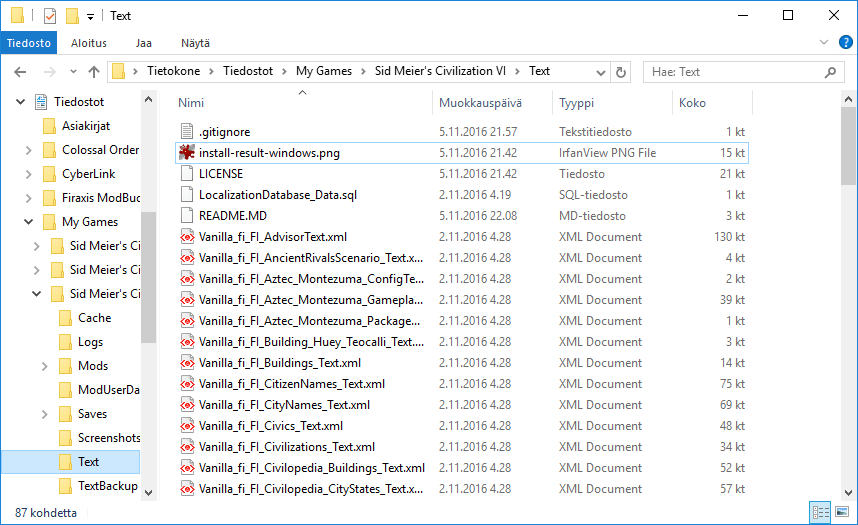

# Civilization VI suomeksi!

This is Finnish language pack for Sid Meier's Civilization VI.
There are currently no installation instructions in English.

2016 Vesa Piittinen | Finnish content is licensed under CC-BY-SA-4.0 
<small>This is a quality oriented fan translation done for free and own amusement. XML files may include untranslated original English game text by Firaxis as a side effect of keeping release progress easy enough to work with.</small>

[Facebook](https://www.facebook.com/civ5suomeksi/) | [Civilization V suomeksi](https://github.com/Merri/civ5suomeksi/)

## Asennus ZIP-tiedostosta

[Lataa ZIP-tiedosto](https://github.com/Merri/civ6suomeksi/archive/text.zip)

Selvitä `Sid Meier's Civilization VI` käyttäjähakemisto. Esimerkkejä sijainnista:

- Windows 7, 8, 10: `C:\Users\KÄYTTÄJÄNIMI\Documents\My Games\Sid Meier's Civilization VI`
- Windows 7, 8, 10: [Git Bash] `cd ~/Documents/"My Games"/"Sid Meier's Civilization VI"`
- Mac OS X: `Users/KÄYTTÄJÄNIMI/Library/Application Support/Sid Meier's Civilization VI`
- Mac OS X: `cd ~/Library/Application Support/Sid Meier's Civilization VI`

Tee sinne uusi hakemisto nimeltään `Text`. Pura ZIP-tiedosto hakemistoon, jolloin `Text`-hakemiston sisältö koostuu tiedostoista kuten `.gitignore`, `LICENSE`, `LocalizationDatabase_Data.sql` ja runsas määrä `Vanilla_fi_FI_`-alkuisia XML-tiedostoja.

### Kielen ottaminen käyttöön

Peli käynnistyy englanninkielisenä, mutta pelin kieliasetuksista (Game Options > Language) voi käydä valitsemassa listasta suomen. Tämän jälkeen pelin kieli vaihtuu suomeksi ja peli käynnistyy jatkossa aina suomenkielisenä :)

## Asennus käyttäen gittiä ja komentoriviä (Git Bash Windowsissa)

Jos et ole asentanut gittiä, niin [käy kipaisemassa se itsellesi!](https://git-scm.com/download) (Asennuksen voi tehdä oletusasetuksin.)

1. Avaa komentorivi (tai Git Bash)
2. Siirry Civ 6:n käyttäjähakemistoon: `cd ~/Documents/My\ Games/Sid\ Meier\'s\ Civilization\ VI`
3. Nyt tiedostot voi kopioida, eli tehdä git-kloonin `Text`-hakemistoon.

Kielipaketin saat tällä loitsulla:

	git clone https://github.com/Merri/civ6suomeksi.git Text

Siirtymällä `Text`-hakemistoon voit jatkossa päivittää kielipaketin uusimpaan versioon näin:

    git pull

**Huom!** 
Jos `Text`-hakemisto löytyy jo ennestään, niin nimeä se vaikka uusiksi, tai poista se mikäli se on tyhjä. Tätä kirjoittaessa hakemistoa ei ole ennestään olemassa, vaan se täytyy luoda itse.
